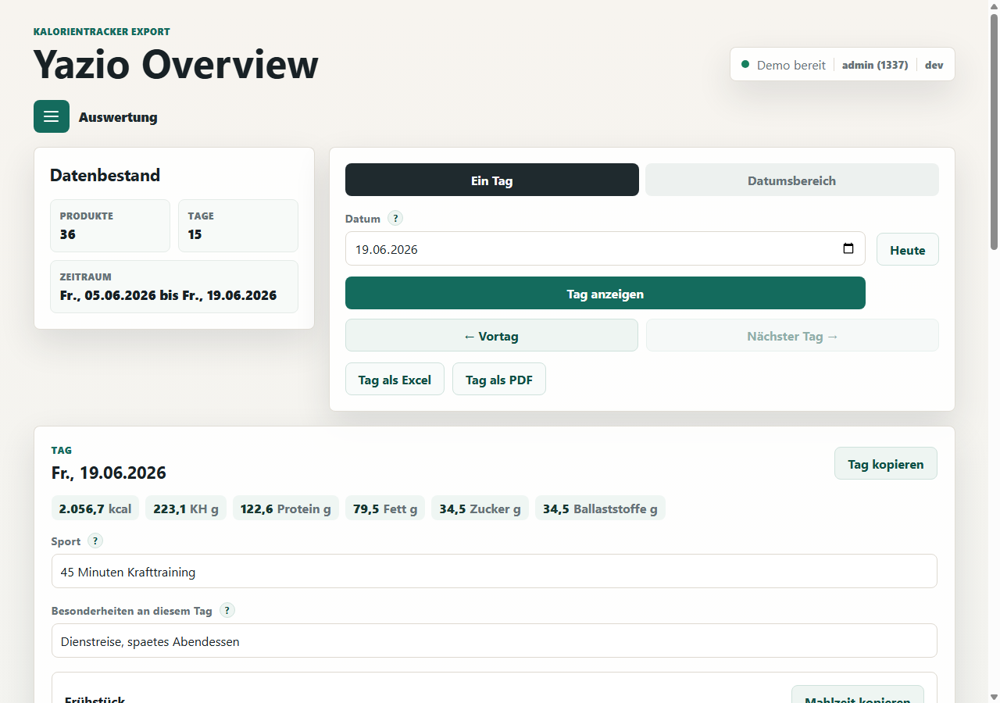
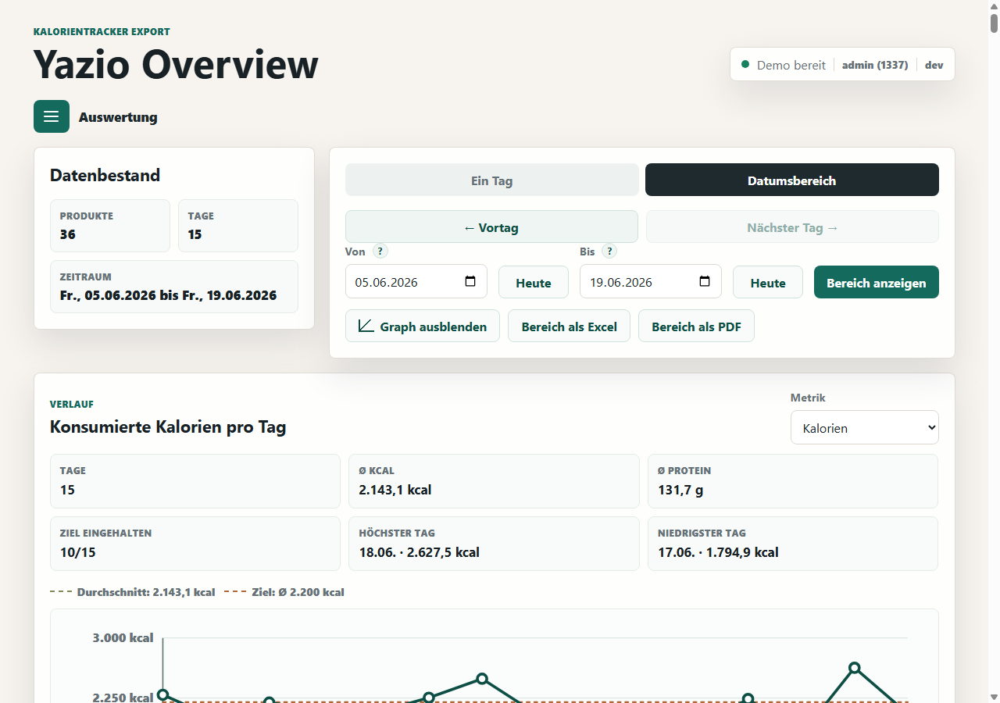
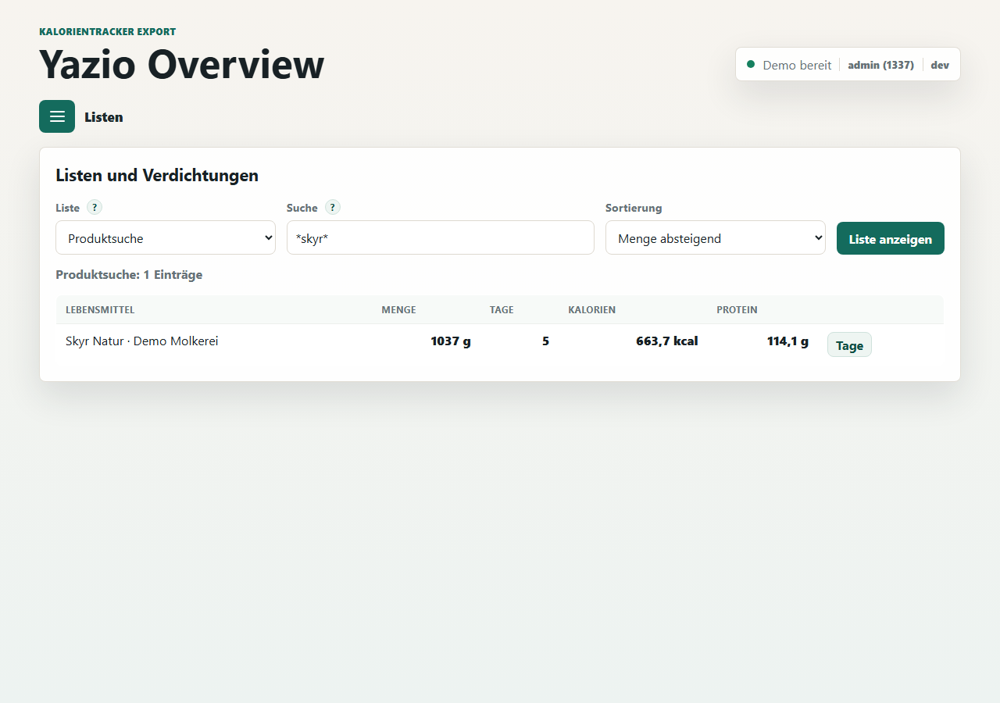
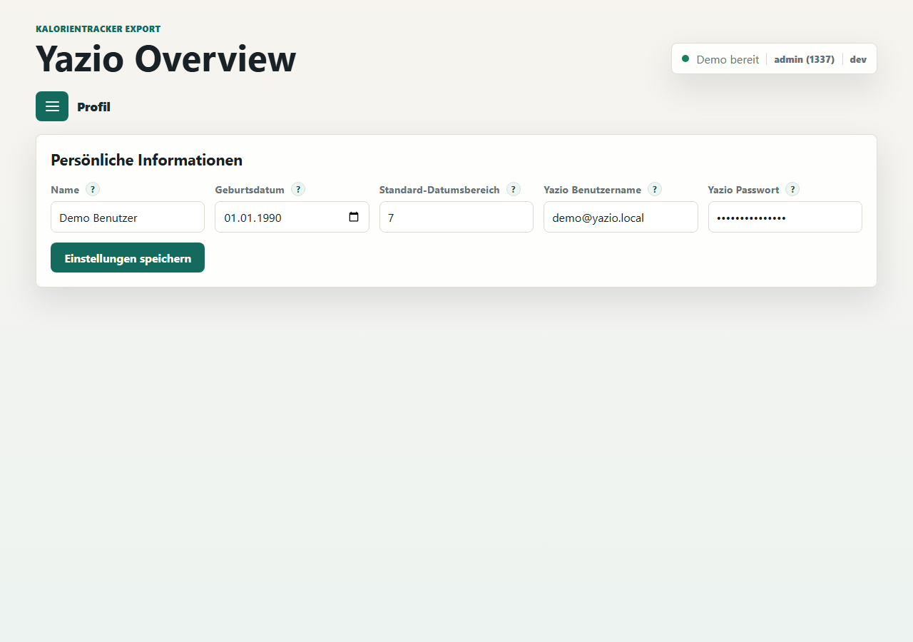
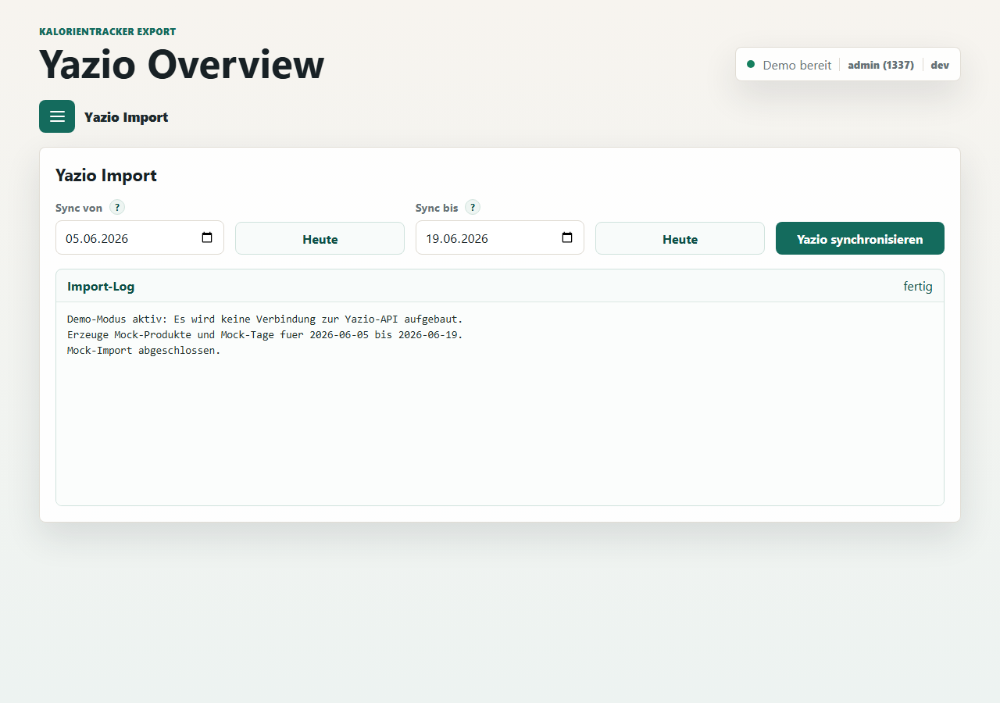
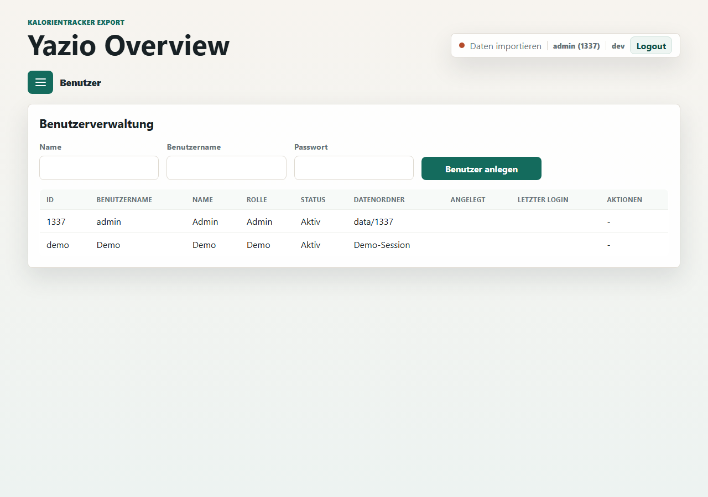
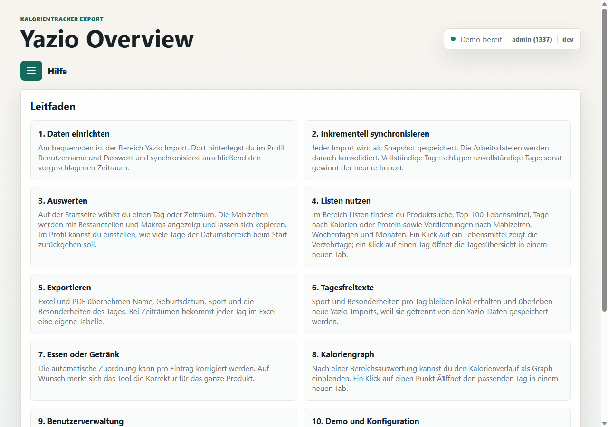
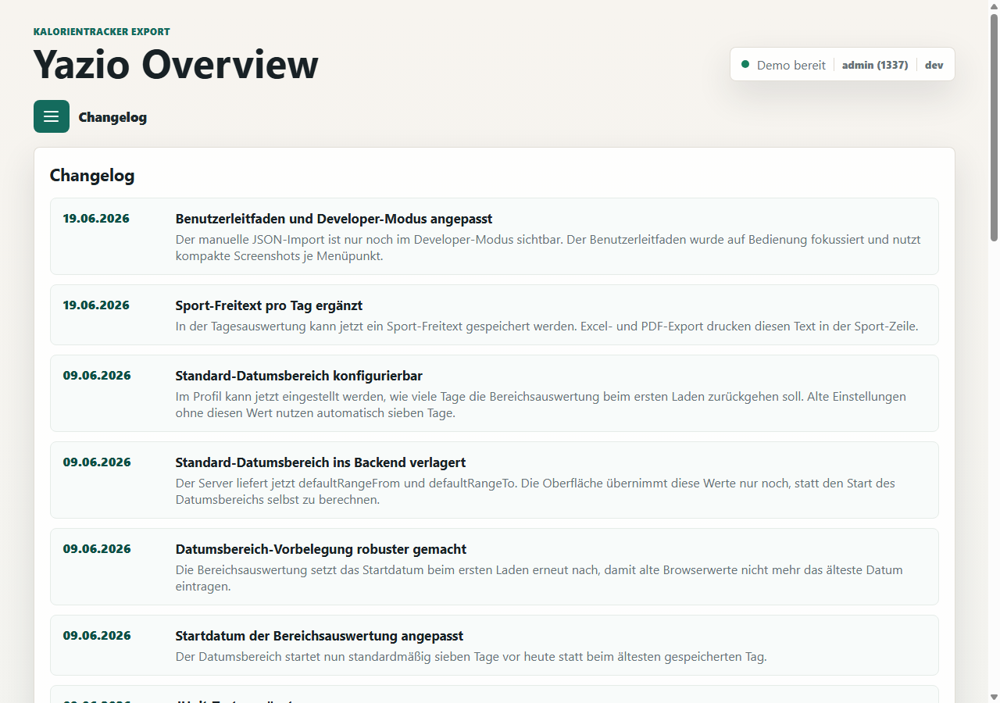

# Benutzerleitfaden fuer Yazio Overview

Stand: 19.06.2026

Dieser Leitfaden beschreibt die Bedienung von Yazio Overview. Er erklaert die sichtbaren Bereiche der Oberflaeche, die wichtigsten Automatismen und die Grenzen einzelner Funktionen. Technische Start-, Build- und Release-Informationen stehen in der README.

Die Screenshots zeigen Demo-Daten. Bei echten Daten sehen Namen, Mengen, Zeitraeume und Werte anders aus.

## Grundprinzip

Yazio Overview wertet lokal gespeicherte Yazio-Daten aus. Der normale Weg ist der direkte `Yazio Import`. Danach kannst du in `Auswertung` einzelne Tage oder Zeitraeume anzeigen, kopieren und exportieren.

Zusaetzliche lokale Eingaben wie `Sport` und `Besonderheiten an diesem Tag` werden getrennt von den Yazio-Daten gespeichert. Sie bleiben deshalb auch nach neuen Importen erhalten.

## Menue und Status

Das Burger-Menue oeffnet die Navigation. Je nach Konfiguration sind nicht alle Menuepunkte sichtbar.

Immer sichtbar:

- Auswertung
- Listen
- Profil
- Yazio Import
- Hilfe
- Changelog

Nur bei aktiver Benutzerverwaltung und Admin-Login sichtbar:

- Benutzer

Oben rechts zeigt die Statusbox:

- ob Daten vorhanden sind
- ob Demo-Daten aktiv sind
- welcher Benutzer angemeldet ist
- die App-Version
- bei Benutzerverwaltung den `Logout`-Button

## Auswertung



Die `Auswertung` ist die Hauptseite. Hier waehlst du entweder einen einzelnen Tag oder einen Datumsbereich.

### Ein Tag

Im Modus `Ein Tag` waehlst du ein Datum und klickst auf `Tag anzeigen`.

Angezeigt werden:

- Tagesdatum und Wochentag
- Tagesmakros
- Sport-Freitext
- Besonderheiten des Tages
- Mahlzeiten
- alle Bestandteile je Mahlzeit
- Makros pro Mahlzeit und Produkt
- Zuordnung `gegessen` oder `getrunken`

Mit `Tag kopieren` wird der komplette Tag in die Zwischenablage kopiert. Mit `Mahlzeit kopieren` kopierst du nur die jeweilige Mahlzeit.

### Vortag und naechster Tag

Die Buttons `← Vortag` und `Naechster Tag →` wechseln den angezeigten Tag. Wenn kein naechster Tag vorhanden ist, wird der Button deaktiviert.

### Sport

Das Feld `Sport` ist ein lokaler Freitext pro Tag. Der Text erscheint spaeter auch in Excel und PDF.

Beispiel:

```text
45 Minuten Krafttraining
```

### Besonderheiten an diesem Tag

Das Feld `Besonderheiten an diesem Tag` ist ebenfalls ein lokaler Freitext pro Tag.

Beispiel:

```text
Dienstreise, spaetes Abendessen
```

### Gegessen oder getrunken

Hinter jedem Eintrag gibt es eine Auswahl `gegessen` oder `getrunken`. Das Tool erkennt die Kategorie automatisch. Wenn die Erkennung nicht passt, kannst du die Auswahl manuell aendern.

Die automatische Erkennung nutzt mehrere Signale, zum Beispiel Einheit, Produktdaten, typische Getraenke und gelernte Korrekturen. Manuelle Korrekturen werden nur gespeichert, wenn sie von der erkannten Kategorie abweichen.

Grenze: Wenn ein Eintrag in Yazio geloescht und spaeter als neuer Eintrag neu importiert wird, kann eine alte manuelle Tageskorrektur nicht zwingend auf den neuen Eintrag uebertragen werden.

## Datumsbereich und Graph



Im Modus `Datumsbereich` waehlst du `Von` und `Bis` und klickst auf `Bereich anzeigen`.

Der Bereich zeigt die Tage einzeln untereinander. Du kannst den kompletten Bereich als Excel oder PDF exportieren.

### Graph

Mit `Graph anzeigen` blendest du einen Verlauf ein. Der Graph zeigt pro Tag einen Punkt. Die Punkte sind verbunden.

Du kannst die Metrik wechseln, zum Beispiel:

- Kalorien
- Protein
- Kohlenhydrate
- Fett

Ein Klick auf einen Punkt oeffnet den passenden Tag in einem neuen Browser-Tab. So bleibt die Bereichsauswertung im aktuellen Tab erhalten.

### Datumsfelder und Automatismen

Die Datumsfelder haben mehrere Automatismen:

- `Heute` setzt das jeweilige Datumsfeld auf das aktuelle Datum.
- Beim ersten Aufruf wird der Standard-Datumsbereich aus dem Profil verwendet.
- Das Startdatum fuer die Auswertung ist normalerweise `heute minus X Tage`.
- `X` stellst du im Profil unter `Standard-Datumsbereich` ein.
- Das Enddatum ist normalerweise heute.
- Wenn Daten vorhanden sind, begrenzen Browser und App die Auswahl auf sinnvolle Werte.
- `Von` darf nicht spaeter als `Bis` sein.
- Wenn `Von` spaeter als `Bis` ist, wird der Bereich nicht ausgewertet.

Grenzen:

- Browser zeigen Datumsfelder je nach Betriebssystem unterschiedlich an.
- Browser-validierungen koennen alte Werte in kleinen Hinweisblasen zeigen, wenn ein Feld vorher einen anderen Maximalwert hatte. Die App prueft den Bereich trotzdem nochmal selbst.
- Wenn fuer einen Tag keine Yazio-Daten vorhanden sind, kann er nicht als Tagesauswertung angezeigt werden.

## Listen



Der Bereich `Listen` sammelt Suchfunktionen und Verdichtungen.

Moegliche Listen:

- Produktsuche
- Top 100 Lebensmittel
- Tage nach Kalorien
- Tage nach Protein
- Verdichtung nach Mahlzeiten
- Verdichtung nach Wochentagen
- Verdichtung nach Monaten

### Produktsuche

Die Produktsuche ist nicht case-sensitiv. Du kannst Sternchen als Platzhalter verwenden.

Beispiel:

```text
*skyr*
```

Das findet Produkte, deren Name irgendwo `skyr` enthaelt.

Das Ergebnis zeigt unter anderem:

- Lebensmittel
- konsumierte Menge
- Anzahl Tage
- Kalorien
- Protein

Mit `Tage` oeffnest du die Tage, an denen das Produkt konsumiert wurde. Ein Klick auf einen Tag oeffnet die Tagesauswertung in einem neuen Tab.

### Sortierung

Je nach Liste kannst du sortieren, zum Beispiel nach Menge, Kalorien, Protein oder Datum.

### Gemerkte Auswahl

Die zuletzt ausgewaehlte Liste wird gespeichert. Wenn du spaeter wieder in den Bereich `Listen` wechselst, ist die letzte Auswahl wieder vorbereitet.

## Profil



Im Bereich `Profil` speicherst du persoenliche Daten und lokale Einstellungen.

### Name

Der Name erscheint in Excel und PDF. Wenn ein Name gespeichert ist, wird er auch fuer Export-Dateinamen genutzt.

### Geburtsdatum

Das Geburtsdatum erscheint in Excel und PDF im Format `TT.MM.JJJJ`.

### Standard-Datumsbereich

Hier stellst du ein, wie viele Tage die Auswertung standardmaessig zurueckgehen soll.

Beispiele:

- `7`: Startdatum ist heute minus 7 Tage.
- `14`: Startdatum ist heute minus 14 Tage.

Diese Einstellung betrifft die vorbelegten Datumsfelder in der Auswertung. Sie veraendert keine gespeicherten Yazio-Daten.

### Yazio Benutzername und Passwort

Diese Zugangsdaten werden lokal gespeichert und fuer den direkten Import genutzt.

Im Demo-Modus werden eingegebene Credentials nicht verwendet. Das Passwortfeld zeigt dann sessionbasiert das Demo-Passwort.

### Passwort aendern

Wenn die Benutzerverwaltung aktiv ist, koennen normale Benutzer ihr lokales Passwort im Profil aendern. Admin- und Demo-Passwort werden anders verwaltet und sind hier nicht aenderbar.

## Yazio Import



Im Bereich `Yazio Import` holst du Daten direkt aus Yazio.

Vor dem Import sollten im Profil Yazio-Benutzername und Passwort gespeichert sein.

Der Importbereich enthaelt:

- Startdatum
- Enddatum
- Heute-Buttons
- Import-Button
- Statusmeldung
- scrollbares Log

### Vorgeschlagener Importzeitraum

Das Tool schlaegt den Importzeitraum automatisch vor:

- Gibt es einen unvollstaendigen Tag, startet der Vorschlag beim aeltesten unvollstaendigen Tag.
- Gibt es keinen unvollstaendigen Tag, startet der Vorschlag mit dem Standard-Rueckblick.
- Das Enddatum ist normalerweise heute.

Damit muessen historische Daten nicht jedes Mal komplett neu geladen werden. Gleichzeitig kann ein heute nur teilweise importierter Tag spaeter automatisch vervollstaendigt werden.

### Import-Log

Waehrend des Imports zeigt die Statuszeile den aktuellen Gesamtzustand. Darunter steht ein scrollbares Log mit Details.

### Demo-Modus

Im Demo-Modus wird keine echte Yazio-Schnittstelle aufgerufen. Der Import erzeugt Mock-Daten und protokolliert das auch im Log.

Grenzen:

- Google-Login und 2FA sind nicht Teil des direkten Imports.
- Wenn Yazio die Schnittstelle oder den Login aendert, kann ein Import fehlschlagen.
- Bei echten Zugangsdaten sollten Benutzername und Passwort korrekt im Profil gespeichert sein.

## Benutzer



Der Bereich `Benutzer` erscheint nur, wenn die Benutzerverwaltung aktiv ist und du als Admin angemeldet bist.

Der Admin kann:

- Benutzer anlegen
- Benutzer aktivieren
- Benutzer deaktivieren
- Benutzer loeschen

Wichtig:

- Der Admin hat die feste ID `1337`.
- Neue Benutzer erhalten IDs ab `1`.
- Jeder Benutzer hat einen eigenen Datenordner.
- Beim Loeschen eines normalen Benutzers wird auch dessen Datenordner geloescht.
- Admin und Demo-Benutzer koennen nicht geloescht werden.
- Deaktivierte Benutzer koennen sich nicht anmelden.

Wenn die Benutzerverwaltung deaktiviert ist, arbeitet die App ohne Login mit dem Admin-Datenordner.

## Hilfe



Die eingebaute `Hilfe` erklaert die wichtigsten Funktionen direkt in der Oberflaeche. Sie ist bewusst kurz gehalten und eignet sich als schnelle Erinnerung.

Fuer ausfuehrlichere Erklaerungen nutzt du diesen Benutzerleitfaden.

## Changelog



Der Bereich `Changelog` zeigt die letzten Aenderungen chronologisch, neueste zuerst.

Der Changelog ist hilfreich, wenn du nach einem Update wissen willst, was neu ist oder warum sich ein Verhalten geaendert hat.

## Exporte

Excel und PDF kannst du aus der Auswertung starten.

### Einzelner Tag

Im Modus `Ein Tag` nutzt du:

- `Tag als Excel`
- `Tag als PDF`

### Datumsbereich

Im Modus `Datumsbereich` nutzt du:

- `Bereich als Excel`
- `Bereich als PDF`

### Inhalt der Exporte

Die Exporte enthalten:

- Name
- Geburtsdatum
- Datum
- Wochentag
- Mahlzeiten
- gegessene Produkte
- getrunkene Produkte
- Makros pro Mahlzeit
- Tagesgesamtwerte
- Sport
- Besonderheiten an diesem Tag

Bei Excel bekommt jeder Tag eines Bereichs ein eigenes Tabellenblatt.

### Dateinamen

Wenn im Profil ein Name gespeichert ist, wird er im Dateinamen verwendet.

Beispiele:

```text
Max_Mustermann_Yazio-Export_19.06.2026.xlsx
Max_Mustermann_Yazio-Export_05.06.2026-19.06.2026.pdf
```

Bei einem einzelnen Tag wird das Datum nur einmal ausgegeben.

## Demo-Daten

Demo-Daten sind zum Ausprobieren gedacht.

Im Demo-Modus gilt:

- Es wird keine echte Yazio-Schnittstelle genutzt.
- Importierte Daten werden simuliert.
- Eingegebene Credentials werden nicht verwendet.
- Mehrere Demo-Sessions sind voneinander getrennt.

Grenze: Demo-Daten sind nicht deine echten Yazio-Daten und eignen sich nicht fuer eine echte Ernaehrungsauswertung.

## Haeufige Fragen

### Warum zeigt der Browser "Nicht sicher"?

Die App laeuft lokal per HTTP. Fuer den lokalen oder internen Betrieb ist das normal.

### Warum sehe ich keine Daten?

Moegliche Ursachen:

- Es wurde noch kein Yazio Import ausgefuehrt.
- Der gewaehlte Zeitraum enthaelt keine Daten.
- Du bist mit einem anderen Benutzer angemeldet.
- Die Benutzerverwaltung wurde aktiviert und der neue Benutzer hat noch keine Daten.

### Was passiert mit Sport und Besonderheiten bei neuen Imports?

Sie bleiben erhalten, weil sie getrennt von den Yazio-Daten gespeichert werden.

### Kann ich mehrere Benutzer parallel nutzen?

Ja, wenn die Benutzerverwaltung aktiv ist. Jeder Benutzer arbeitet in seinem eigenen Datenordner.

### Was passiert, wenn ein Tag erst unvollstaendig importiert wurde?

Ein spaeterer vollstaendiger Import kann den unvollstaendigen Tag ersetzen. Das ist Absicht, damit ein am Mittag importierter Tag spaeter korrekt vervollstaendigt werden kann.
